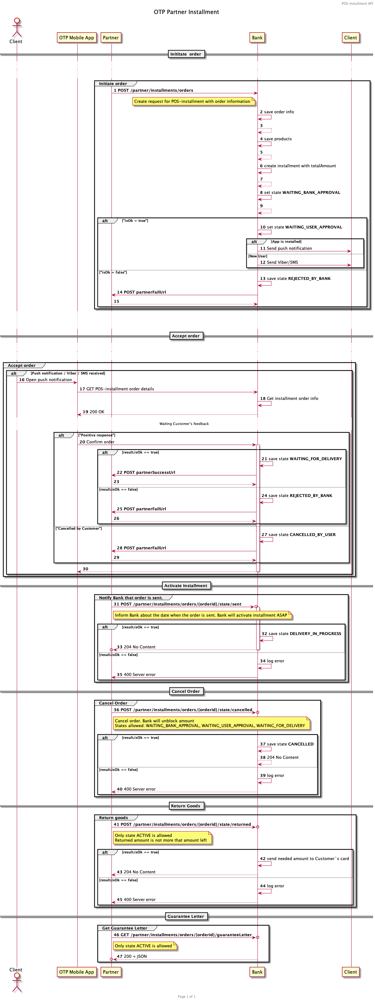
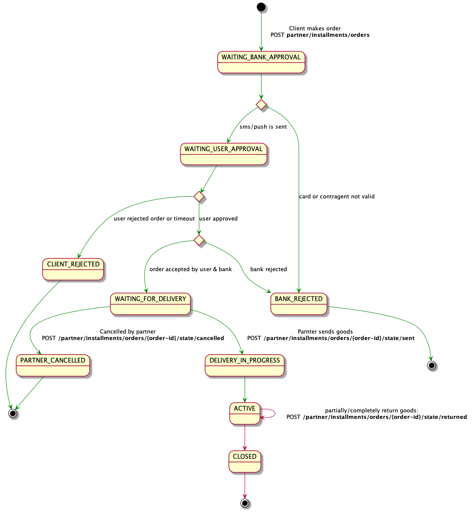

**Зміст:**
- [Як користуватися специфікацією?](#як-користуватися-специфікацією)
- [Бізнес-процес](#бізнес-процес)
- [* Партнер повідомляє про доставку](#-партнер-повідомляє-про-доставку)
- [Стани та переходи між ними](#стани-та-переходи-між-ними)
  - [Діаграма станів](#діаграма-станів)
  - [Отримання callback про зміну статусу](#отримання-callback-про-зміну-статусу)
    - [onSuccessUrl](#onsuccessurl)
    - [onFailedUrl](#onfailedurl)
  - [Параметри авторизації](#параметри-авторизації)
  - [Інформація, що надходить у **Callback**](#інформація-що-надходить-у-callback)
- [Обробка помилок](#обробка-помилок)
  - [Формат помилок](#формат-помилок)
  - [Помилки, що потребують додаткової обробки <a name="error-logic"></a>](#помилки-що-потребують-додаткової-обробки-)
- [API-Security](#api-security)
  - [Процес підключення](#процес-підключення)
  - [Налаштування підключення до API](#налаштування-підключення-до-api)
  - [Алгоритм перевірки підпису на стороні банку](#алгоритм-перевірки-підпису-на-стороні-банку)
  
## Як користуватися специфікацією?

Специфікація REST API, для підключення партнерів до продукту POS Installments "Скибочка" від OTP Bank надається згідно стандарту [OpenAPI 3.1](https://www.openapis.org/blog/2021/02/18/openapi-specification-3-1-released)

Для роботи рекомендуємо використовувати наступні інструменти:
- https://stoplight.io/studio
- https://swagger.io/tools/swagger-editor/
- https://www.jetbrains.com/help/idea/openapi.html


## Бізнес-процес

Загальний процес відкриття розстрочки включає в себе наступні етапи:
* Партнер відправляє замовлення в Банк від імені клієнта
* Клієнт підтверджує замволення впродовж 15 хвилин
* Банк підтверджує замовлення
* Банк надає Партнеру лист-гарантію про готовність профінансувати кредит
* Партнер повідомляє про відправлення товару на доставку
* Банк активує розстрочку 
* Партнер повідомляє про доставку
---
* Партнер має право відмінити замовлення до підтвердження факту відправки товару
* Партнер має право повідомити Банку інформацію про частково або повністю повернуті замовлення.



## Стани та переходи між ними

### Діаграма станів



### Отримання callback про зміну статусу

Під час створення замовлення Партнер може надати посилання, куди буде відправлено інформацію про стан замволення при його зміні

#### onSuccessUrl
Буде викликано при переході на стан:
- WAITING_FOR_DELIVERY
  
#### onFailedUrl
Буде викликано при переході на стан:
- CLIENT_REJETED
- BANK_REJECTED
- PARTNER_CANCELLED

### Параметри авторизації

Метод **Callback** підримує наступні види авторизації на сайті партнера:
- NONE
- BASIC (username:password)
- BEARER (JWT)

Метод **Callback** не передбачає проходження додаткової авторизації на додаткових ресурсах

### Інформація, що надходить у **Callback**

Разом з викликом Callback URL, передається інформація, аналогічна тієї, що передається у запиті

```GET  /partner/installments/orders/{orderId}/state ```

## Обробка помилок

### Формат помилок

Під час роботи з API, можуть виникати помилки з різними типами HTTP статус кодів:

| **Статус код**    | **Коментар**    |
| ----------------- | --------------- |
|400 - Bad Request|необхідно додатково обробити інформцію у полі response.type, що надходить у відповіді на запит (див. таблицю помилок, що потребують додаткової валідації)|
|401 - Unauthorized|не надано JWT token у Authorization Header|
|403 - Forbidden|доступ за наданою інформацію заборонено|
|404 - Not Found|ресурс не знайдено, перевірте endpoint URI, на який відправляється запит|
|500 - Internal Error|необроблена серверна помилка|
|503 - Service Unavailable|інфраструктурні технічні роботи|

<!-- theme: info -->
> помилки, що потребують додаткової інформації (httpStatusCode == 400) супароводжуються **responseBody** у наступному форматі

``` json
{
  "code": 90002,
  "type": "CONSTRAINT_VALIDATION_VIOLATION",
  "message": "One or several required fields are not valid. See causes",
  "causes": [
    "cause 1: ...",
    "cause 2: ..."
  ]
}
```
---

### Помилки, що потребують додаткової обробки <a name="error-logic"></a>

Рекомендуємо з боку інтерфейсів партнерів надавати більш детальну інформацію про виникнення помилки при оформленні замовлення. Подальшу комунікацію клієнти будуть отримувати від мобільного банкінгу.

| **Код помилки** | **Тип помилки** | **Коментар** |
| --------------- | --------------- | ------------ |
| 90002 | CONSTRAINT_VALIDATION_VIOLATION | запит, що надіслано не відповідає специфікації. Див. деталі у **response.causes** |
| 46001 | PARTNER_AUTH_NOT_VALID | не валідні авторизаційні дані, надіслані в Authorization та X-Signature headers |
| 46002 | PARTNER_ACCESS_DENIED | замовлення, по якому відправлено запит створено іншим партнером |
| 46003 | WRONG_MERCHANT | такого мерчанта не існує |
| 46004 | NO_CARDS_AVAILABLE | Потребує комунікації клієнту! не знайдена кредитна картка з необхідним лімітом на розстрочку для клієнта з наданим номером телефону або не існує такого клієнта |
| 90006 | USER_COLLISION | Знайдено декілька клієнтів за таким фінансовим номером. Необхідно встановити мобільний застосуноку OTP Credit або звернутися до найближчого відділення |
| 90007 | USER_INFO_INCOMPLETE | Недостатньо даних по Клієнту для оформлення розстрочки. Необхідно звернутися до команди розробки API |

## API-Security

### Процес підключення
Процесс получения доступа к POS-Installment Partners API от OTP Bank включает в себя следующие шаги:
1. Подача заявки на подключение к тестовому API
2. Получение token + API secret по СМС на номер ответсвенного специалиста по технической части
3. Интеграция с API в тестовом окружении
4. Прохождение тестов, OTP Bank отправляет тест кейсы
5. Партнер и OTP Bank заключают договор, после чего все данные из договора используются для подключения. Token и API Secret отправляются партнеру на завершающем этапе подключения как Viber/SMS сообщение
<!-- theme: warning -->
> #### Важливо
> Храните token и API Secret в защищенном хранилище. Получение злоумышленниками доступа к паре клюей ведет к рискам Fraud атак.
< При компроментации token и API Secret необходимо обратиться к техническим контактам для отзыва старый и генерации новых ключей.

### Налаштування підключення до API
Партнер отримує в смс-повідомленні комбінацію (String JWT, UUID Secret)
В JWT лежать claim.upn = ідентифікатор партнера, claim.kid = версія ключа (secret version)
Відправляючи реквест на захищений ендпоінт, партнер додає до нього headers:
- "Authorization" = "Bearer JWT", де JWT це значення, отримане в смс партером
- "X-Request-Id" = random UUID requestId, унікальний ідентифікатор, значення якого буде використовуватись
під час перевірки підпису реквесту
- "X-Merchant-Id" = Long merchantId, ідентифікатор мерчанта, від імені якого
відбувається запит. У одного партнера може бути багато мерчантів.
- "X-Signature" = String signature, підпис конкретного запиту за алгоритмом

### Алгоритм перевірки підпису на стороні банку

1. String payload = requestId + uri + requestBody String payload = requestId + urib. для запитів без body (GET):uri - ідентифікатор ресурсу, приклади ідентифікатора:
   1. /partner/installments/orders
   2. /partner/installments/orders/4242b56c-e95e-4bb8-b9d5-3416aa7e7134/state/returned

Для отриманої secret version (claim.kid) знаходимо виданий партнеру secret
key = secret.getBytes(StandardCharsets.UTF_8)digest = payload
З метою ознайомлення можна використовувати наступний метод генерації HMAC:


``` Java
    public static byte[] generateHmac(byte[] secretKey, String... digestParams) {
        String digest = StringUtils.join(digestParams); // concat
        try {
            Mac mac = Mac.getInstance("HmacSHA256");
            SecretKeySpec secretKeySpec = new SecretKeySpec(secretKey, "HmacSHA256");
            mac.init(secretKeySpec);
            return mac.doFinal(digest.getBytes(StandardCharsets.UTF_8));
        } catch (Exception ex) {
            throw new RuntimeException("Failed to calculate hmac ", ex);
        }
    }
```
Таким чином, результатом кроку 3 буде отримання
```
byte[] hmacValue = generateHmac(secret.getBytes(StandardCharsets.UTF_8), payload)
```
String hmacEncoded = Base64.getEncoder().encodeToString(hmacValue)
```
Objects.equals(signatureReceived, signatureGenerated == hmacEncoded)
```

Якщо дані співпадають, реквест від партнера вважається валідним і його буде виконано.
Приклад побудови підпису реквеста
Наступний тестовий клас дозволяє ознайомитись з процесом побудування підпису реквеста:

``` Java

import org.apache.commons.lang3.StringUtils;
import org.junit.jupiter.api.Test;
import javax.crypto.Mac;
import javax.crypto.spec.SecretKeySpec;
import java.nio.charset.StandardCharsets;
import java.util.Base64;
import java.util.UUID;
import static org.junit.jupiter.api.Assertions.assertEquals;
public class PartnersSecurityUnitTest {
    @Test
    public void validateSignatureCreateOrderRequestSuccess() {
        // GIVEN
        String secret = "19e6d802-3283-4645-bfc2-6ea9c2dec0e7"; // you dont send this value in request
        String uri = "/partner/installments/orders";
        UUID requestId = UUID.fromString("72a0c809-6216-459c-a4a4-43900d26e952");
        String requestBody = "{\n" +        // == raw body bytes string representation, new String(rawBody, UTF_8)
                "  \"phoneNumber\" : \"380966810310\",\n" +
                "  \"periodsChosen\" : \"6\",\n" +
                "  \"totalAmount\" : {\n" +
                "    \"value\" : 100.0,\n" +
                "    \"currency\" : \"UAH\"\n" +
                "  },\n" +
                "  \"vatAmount\" : {\n" +
                "    \"value\" : 10.0,\n" +
                "    \"currency\" : \"UAH\"\n" +
                "  },\n" +
                "  \"onSuccessCallbackURI\" : \"http://success-uri.com\",\n" +
                "  \"onFailCallbackURI\" : \"http://fail-uri.com\",\n" +
                "  \"storeOrder\" : {\n" +
                "    \"storeId\" : \"store11\",\n" +
                "    \"orderNumber\" : \"order11\",\n" +
                "    \"invoiceNumber\" : \"invoice11\",\n" +
                "    \"createdAt\" : \"2021-05-25T16:00:01.956Z\",\n" +
                "    \"products\" : [\n" +
                "      {\n" +
                "        \"name\" : \"product1\",\n" +
                "        \"totalAmount\" : {\n" +
                "          \"value\" : 30.0,\n" +
                "          \"currency\" : \"UAH\"\n" +
                "        },\n" +
                "        \"count\" : 3,\n" +
                "        \"category\" : \"category1\"\n" +
                "      },\n" +
                "      {\n" +
                "        \"name\" : \"product2\",\n" +
                "        \"totalAmount\" : {\n" +
                "          \"value\" : 40.0,\n" +
                "          \"currency\" : \"UAH\"\n" +
                "        },\n" +
                "        \"count\" : 2,\n" +
                "        \"category\" : \"category2\"\n" +
                "      },      \n" +
                "      {\n" +
                "        \"name\" : \"product3\",\n" +
                "        \"totalAmount\" : {\n" +
                "          \"value\" : 20.0,\n" +
                "          \"currency\" : \"UAH\"\n" +
                "        },\n" +
                "        \"count\" : 5,\n" +
                "        \"category\" : \"category3\"\n" +
                "      }\n" +
                "    ],\n" +
                "    \"source\" : \"STORE\"\n" +
                "  }\n" +
                "}";
        // ACT
        String payload = buildValidationPayload(requestId, uri, requestBody);
        byte[] key = secret.getBytes(StandardCharsets.UTF_8);
        byte[] hmacValue = generateHmac(key, payload);
        String hmacEncoded = Base64.getEncoder().encodeToString(hmacValue);
        // ASSERT
        String signatureExpected = "NdkoErin+WY1nzynaUfp/r65fJ5k1VkYnc4upaNxlV8=";
        assertEquals(signatureExpected, hmacEncoded);
    }
    @Test
    public void validateSignatureGetOrderStatusRequestSuccess() {
        // GIVEN
        String secret = "19e6d802-3283-4645-bfc2-6ea9c2dec0e7";     // you dont send this value in request
        String uri = "/partner/installments/orders/4242b56c-e95e-4bb8-b9d5-3416aa7e7134/state";
        UUID requestId = UUID.fromString("5135e057-2f86-4c7f-af80-f2e2b0c967d0");
        String requestBody = null;  // no body in GET request
        // ACT
        String payload = buildValidationPayload(requestId, uri, requestBody);
        byte[] key = secret.getBytes(StandardCharsets.UTF_8);
        byte[] hmacValue = generateHmac(key, payload);
        String hmacEncoded = Base64.getEncoder().encodeToString(hmacValue);
        // ASSERT
        String signatureExpected = "zLsjwdCMR7EnPdI1mOPozoTp0L5XgkOEOIFPD44wZqQ=";
        assertEquals(signatureExpected, hmacEncoded);
    }
    private String buildValidationPayload(UUID requestId, String uri, String requestBody) {
        if (requestBody == null) {
            requestBody = "";
        }
        return requestId.toString() + uri + requestBody;
    }
    private byte[] generateHmac(byte[] secretKey, String... digestParams) {
        String digest = StringUtils.join(digestParams); // concat
        try {
            Mac mac = Mac.getInstance("HmacSHA256");
            SecretKeySpec secretKeySpec = new SecretKeySpec(secretKey, "HmacSHA256");
            mac.init(secretKeySpec);
            return mac.doFinal(digest.getBytes(StandardCharsets.UTF_8));
        } catch (Exception ex) {
            throw new RuntimeException("Failed to calculate hmac ", ex);
        }
    }
}
```

